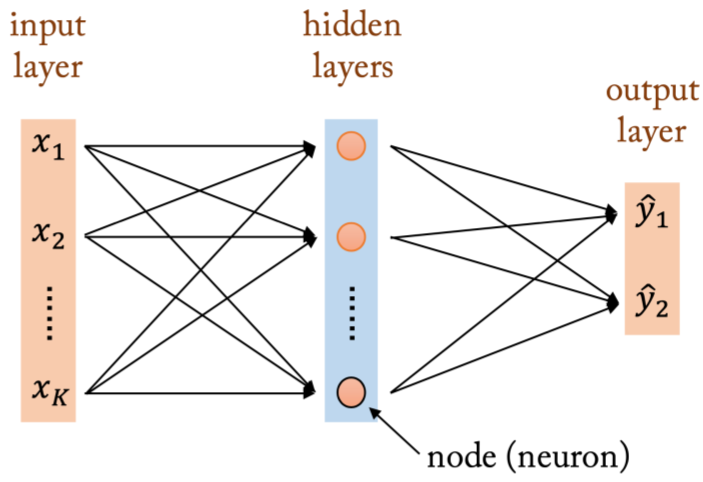

# Lecture 3  
## 딥러닝과 통계학
### 다층신경망

 - 다층퍼셉트론 : 은닉층 포함됨 다층신경망
 - 입력 -> 은닉 통과할때마다 활성화함수 적용돼서 -> 출력
 - **같은 층 연결x 앞의 층으로만 연결**

### 활성화 함수
 - 시냅스 : 뉴런은 시냅스 통해 연결
 - 활성화 함수 : 시냅스 기능을 구현
 - 활성화 함수 종류 : 항등함수, 시그모이드, tanh, ReLU
 - sigmoid, tanh(경사소실문제) -> ReLU(얘도 0미분불가)

### 일반근사정리
 - 은닉층이 1개더라도 뉴런이 충분히 많다면 모든함수를 표현할수 있다.
 - 은닉층수 많아지면 -> 신경망 정확도 상승, 추상적으로 파악해 표현력 좋아짐
 - but 층별 뉴런수를 늘리는것의 효율은 그다지 좋지못함

### 1️⃣ 통계학과 머신러닝의 관계
- **통계학**: 데이터를 통해 배우는 과학, 확률이론 기반의 통계적 추론 중심  
- **머신러닝**: 확률모형 대신 데이터 기반 알고리즘 중심  
  - 빅데이터 + 고성능 컴퓨팅으로 통계학이 **알고리즘 기반 추론**으로 확장됨  
  - 통계학의 “추정·검정” → 머신러닝의 “학습(learning)”  

| 구분 | 전통 통계학 | 딥러닝/머신러닝 |
|------|--------------|----------------|
| 데이터 크기 | 소규모 | 대규모 |
| 모형 구조 | 생성구조 + 오차 | 오차 무시, 예측 중심 |
| 모형 차원 | 저차원 | 고차원 |
| 평가 기준 | 적합도, 유의성 | 예측력 |
| 목적 | 원인 설명 | 결과 예측 |

---

### 2️⃣ 확률분포 (Probability Distribution)

딥러닝도 확률이론 위에서 작동함.  
데이터를 생성하는 **확률분포**를 추정하는 과정.

- 이산형 확률변수 → 확률질량함수 (PMF)  
- 연속형 확률변수 → 확률밀도함수 (PDF)

#### 확률과 정보량
$$
I(E) = -\log P(E)
$$
- 확률이 작을수록 정보량이 큼 (드문 사건 → 정보 많음)

---

### 3️⃣ 엔트로피 (Entropy)
정보량의 기댓값 = 불확실성의 측정치

$$
H(X) = -\sum_i f(x_i)\log f(x_i)
$$

- 엔트로피 ↓ → 확실한 사건  
- 엔트로피 ↑ → 불확실한 사건  

---

### 4️⃣ 주요 확률분포

#### (1) 베르누이 분포 (Bernoulli)
- 두 결과 {0,1}
$$
f(x) = p^x (1-p)^{1-x}, \quad x \in \{0,1\}
$$
- 기댓값: \( E[X] = p \)  
- 분산: \( Var[X] = p(1-p) \)  
- 이진 엔트로피:
$$
H(X) = -p\log p - (1-p)\log(1-p)
$$

#### (2) 멀티누이 분포 (Multinoulli)
- K개의 범주  
- 예: 숫자 0~9 분류  
$$
P(X_1=x_1, ..., X_K=x_K) = \prod_{k=1}^{K} p_k^{x_k}, \quad \sum p_k = 1
$$
→ 소프트맥스 회귀모형의 기반

#### (3) 정규분포 (Normal)
$$
f(x) = \frac{1}{\sqrt{2\pi\sigma^2}} 
\exp\left( -\frac{(x-\mu)^2}{2\sigma^2} \right)
$$
- \( E[X] = \mu \), \( Var[X] = \sigma^2 \)
- 엔트로피:
$$
H(X) = \frac{1}{2}\log(2\pi e\sigma^2)
$$

---

### 5️⃣ 정보이론과 딥러닝

- **교차엔트로피**: 실제 분포와 예측 분포의 차이  
- **KL 발산 (Kullback–Leibler Divergence)**:
$$
D_{KL}(P||Q) = \sum P(x)\log\frac{P(x)}{Q(x)}
$$
- 엔트로피 최소화 → 불확실성 감소 → 학습이 잘된 상태

---

### 6️⃣ 통계학 vs 딥러닝

| 항목 | 통계학 | 딥러닝 |
|------|---------|--------|
| 목표 | 왜 일어났는가 (해석 중심) | 무엇이 일어날 것인가 (예측 중심) |
| 접근법 | 가정 기반 추정 | 데이터 기반 학습 |
| 해석성 | 투명 | 블랙박스 |
| 데이터 크기 | 소표본 | 대규모 |
| 결과 평가 | 유의성 검정 | 예측 정확도 |

---

> **요약:**  
> 딥러닝은 확률·통계의 연장선에 있으며, “예측 중심의 통계학”이다.